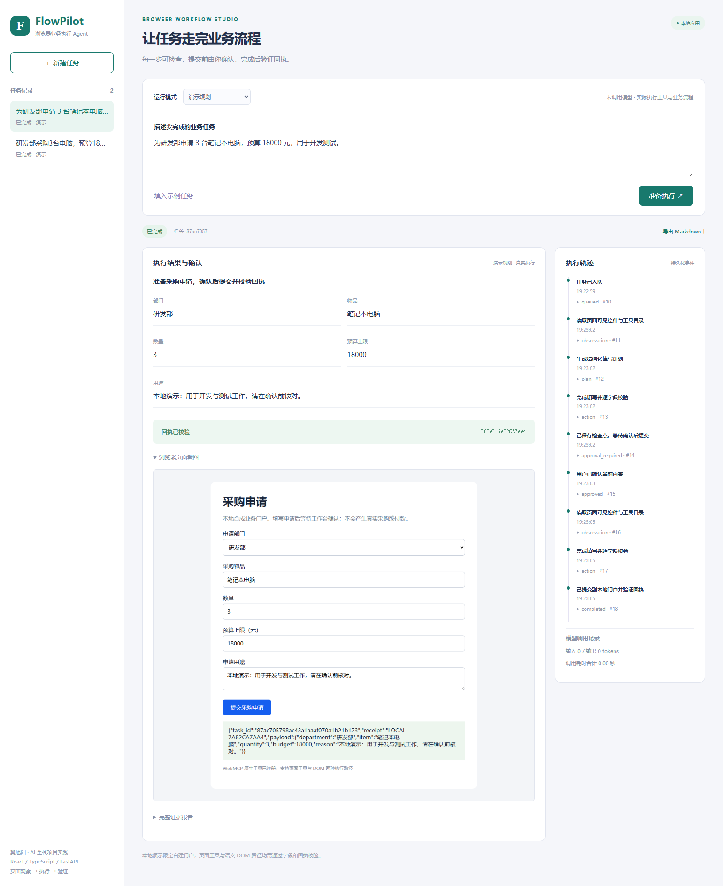

# FlowPilot 浏览器业务流程 Agent

个人独立设计与搭建的 AI 全栈应用：把自然语言采购任务转换为可检查的页面填写，暂停等待用户确认，再提交到自建演示门户并验证回执。使用 React / TypeScript、FastAPI、Playwright、Pydantic、SQLite、SSE 与实验性 WebMCP 页面工具注册。



## 完整流程

1. Chromium 访问自建门户，观察可见控件、枚举选项及页面工具目录。
2. 规划器生成结构化字段与执行路径；页面内容作为数据，模型没有任意脚本或提交工具。
3. 支持页面工具填写与 get_by_label 语义 DOM 填写两种路径。填写后逐字段核对，记录相对基线的控件差量，保存截图。
4. 持久化待确认状态和填写内容的 SHA-256 摘要，关闭临时浏览器；工作台显示实际字段供用户核对。
5. 确认接口校验摘要后启动新浏览器恢复填写。提交接口再次校验确认内容，以任务 ID 唯一键保存回执；中断恢复时复用既有回执，防止重复提交。

WebMCP 是实验 API。页面在浏览器支持时进行原生工具注册；当前执行器通过本地页面工具适配器调用与注册工具相同的函数，不宣称完整 MCP 客户端。无原生支持时保留工具适配器与语义 DOM。可在任务文字中加入 `DOM` 体验 DOM 路径。

## 安装与运行

需要 Python 3.12+、Node.js 20+。

```powershell
python -m venv .venv
.venv\Scripts\python.exe -m pip install -r requirements.txt
cd frontend
npm.cmd ci
npm.cmd run build
cd ..

.venv\Scripts\python.exe -m playwright install chromium
powershell -ExecutionPolicy Bypass -File .\start.ps1

```

浏览器打开 <http://127.0.0.1:8202>，API 文档为 `/docs`。默认演示模式不调用模型，但数据库、工具和页面实际执行。真实模型模式需要将 `.env.example` 复制为 `.env` 并配置兼容接口。没有验证真实供应商端到端成功率，模型修复测试使用可控模拟响应。

## 测试

```powershell
.venv\Scripts\python.exe -m pytest tests -q
```

应用仅供本地单用户作品展示，没有生产鉴权；示例数据与门户均为合成内容。密钥、数据库、依赖目录不提交 Git。模型返回内容一律经过结构化校验，仍需用户核对业务含义。

实现与面试讨论见 [工程说明](docs/INTERVIEW.md)。

## 设计参考

应用独立实现，没有 fork 或复制参考项目的业务代码。参考产品方向与官方资料：

- [DataFoundry](https://github.com/datagallery-ai/dataagent)（GitHub 创建于 2026-06-18）：可治理数据分析任务与证据追溯。
- [Tencent BrowserSkill](https://github.com/Tencent/BrowserSkill)（GitHub 创建于 2026-06-22）：浏览器业务自动化方向。
- [Chrome WebMCP](https://developer.chrome.com/docs/ai/webmcp)：页面工具的实验性浏览器接口。

基础依赖的许可仍由对应项目维护；独立应用使用 MIT 许可。
